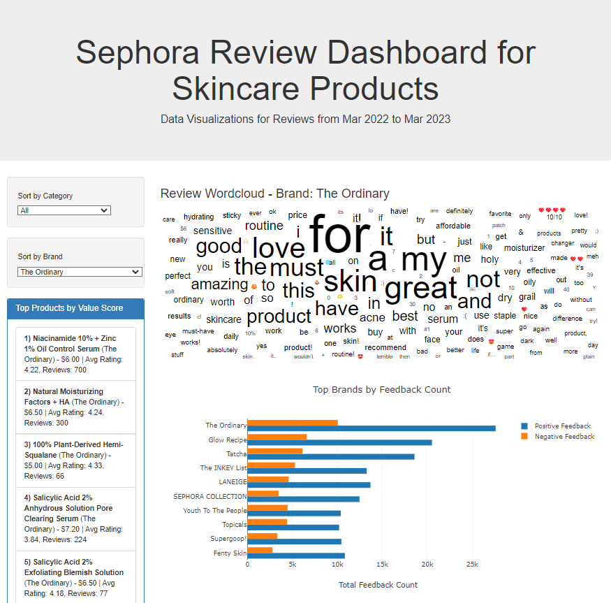
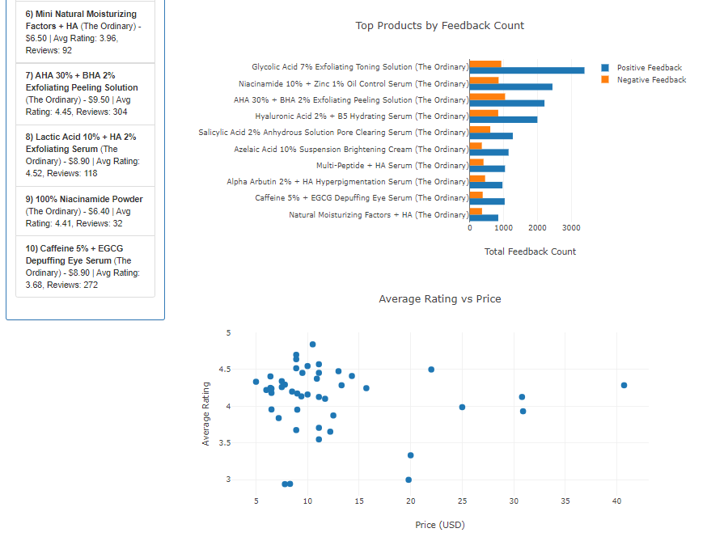

# Sephora Review Dashboard

Download the repo, run `app.py` and click below to get started!

https://dcasey07.github.io/sephora-reviews/

## Overview and Usage

Welcome to the Sephora Skincare Review Dashboard! This app will empower users with the ability to generate visualizations using a database comprised of review data from Sephora's website detailing consumer reviews on skincare products from March 2022 to March 2023, as well as each of these products' price and rating. Upon loading the dashboard will populate with all of the data in the database into the following visualizations:
- **Wordcloud of Review Headers:** Get the cliffnotes on how consumers review items on Sephora's website using the titles that they put on their reviews.
- **Feedback Counts:** Split into two bar charts are visualizations that show the top brands and products in terms of how Sephora users respond to feedback on their reviews.
- **Rating vs. Price:** A scatterplot that displays the average rating of products juxtaposed with their price.
- **Value Score:** A ranking that employs a calculation of rating, price, and review count to assess the overall value of the product. Value score is a calculation that utilizes average rating per product, multiplies it by a logaritmic value of the product's review count, and then divides those values by the price of the product to generate a score to assess the overall value of a product.
- **Filtering by Category and Brand:** By default, all of the data will display, however the dashboard will display breakdowns of the data to more granular views by selecting options from the dropdowns. As a note, the non-alphanumeric elements of the url composition are encoded in the `app.js` file using `encodeURIComponent`

### Objective and Purpose: Why Use This Dashboard?
This dashboard offers simple, but effective visualizations to consumers and producers alike by detailing consumer responses to product lines while also taking deep looks at the categorical and brand breakdowns to see how different companies operate in the same marketplace. For example, filtering by brand will detail an entire brand's skincare catalog, allowing users to see how responsive useful the community of Sephora consumers interacts with their reviews, as well as how they price their products. Filtering even further by category will tighten the lens on a particular brand's catalog within it's own similar line of products. This enables users to see how their own products stack up against one another in terms of price, average rating, and overall feedback counts.

### Methodology
This project was created using python and jupyter notebook to concatenate the data, and then cleaned by removing unnecessary columns. The data was then put into a sqlite database, where it was called to api routes using python and flask. The visualizations were then generated using JS and HTML through the d3 library, plotly, as well as Jason Davies' d3-cloud.

Value score is calculated by taking the average rating per product and multiplying it by the review count. This value is then divided by the price of the product. To avoid the exponential effects of highly reviewed product that either have been on the market longer, or are potentially flooded by bots, a logarithm was used to smooth the curve on the review counts.

## Data Sources, Collection, Attributions, and Ethical Considerations
- Data for this project was sourced from https://www.kaggle.com/datasets/nadyinky/sephora-products-and-skincare-reviews by Nady Inky. The Wordcloud libray implentation was sourced from https://github.com/amueller/word_cloud.
- Wordclouds were generated utlizing Jason Davies' d3-cloud module, which can be found here: https://cdnjs.cloudflare.com/ajax/libs/d3-cloud/1.2.5/d3.layout.cloud.js.
- Information that pertained to personal consumer information regarding their physical features, such as eye color and skin tone, were intentionally omitted to remove any consumer biases or potential for singling out specific users.
- Disclaimer was left in the hovertext of Value Score highlighting that it is merely a tool comprised using hard data from the dataset and does not in any way guarantee quality or performance when used for making purchasing decisions. In addition, there are zero biases or considerations made that would skew data towards any one particular brand or category.
- The Value Score generated in the dashboard attempts to curb the effects of potential bots in the review space by applying a logarithm to the review counts in order to avoid exponential benefits to potentially over-reviewed products.
- This project was created by Daniel Casey, Lisa Lonstein, Andre Mako, Suman Murali, and Tehreem Uzma.

#### Recent Updates from Development
1/8/24 (DC): Added wordcloud for the review headers to `app.js` and `index.html`. Also added right justified language to `index.html` so the visualizations should remain in the same general space when the Value Score panel is not fully populated.

1/8/24 (DC): Added feedback count visualizations for brand and products to `app.js`.

1/6/24 (DC): Added `reviews.sqlite` and `app.py` with Flask API so we can create individual routes for our data. This is updated in `app.js` to now accommodate the routes rather than the hosted AWS .json file, but the hosted .json file is still there (commented out) for testing code if needed, just keep in mind the load times if you use it. Brand and category dropdowns function properly and update visualizations and information on the client. Added value score and top products list. Also added a price vs. rating scatter plot.

1/3/24 (DC): Updated `app.js` so the dropdowns now support (All) functionality.

12/29/23 (DC): Updated `index.html` and `app.js` so the dropdowns are populated with the category and brand info. There's code commented out for updating the graphs by category and brand when they get added in, so make sure you check that out to test if it's working while coding the visualizations.

12/28/23 (DC): In order to get our json to load I had to shrink our dataset to only include entries from March 2022 to March 2023 (Mar 2023 are the most recent entries in the dataset). The good news is you guys should be able to open up `app.js` and be able to test your code and `console.log` the information using live server on the `index.html` file. For reference: `oneyear_df.json` is the name of the file, but it's already coded into `app.js`.

Some things to be aware of:
- Even shrunk down this file is still pretty big (137mb to be exact) and, as such it takes a few minutes to load - so be patient when loading it and avoid refreshing when you get antsy.
- I'm personally hosting this on AWS, and the way it works I have to pay if the number of requests that are made to it goes over a certain data threshold. Since this file is still pretty sizeable, try to avoid refreshing it constantly so it doesn't constantly make api calls.
  - I'm not policing this and I don't understand it well enough to work around it, but I'm also aware that we have work that needs to be done, so just try your best to not refresh it habitually. If you have to refresh it because it stops loading or you updated something and need to see it in action it's totally fine, I just want everyone to be aware that it's a thing.

12/19/23 (DC): I uploaded the resources, starter code, and some files that we'll need to develop later on. Please make sure you all create a branch on the github and always pull from main before beginning to work on anything to avoid issues with staying up to date on commits. Always upload to your own branch so the changes can be checked over first when pull requests are made.

To pull from main before working on files:

`git pull origin main`

To create a new branch use the following, filling in what you want to call it after the -b:

`git checkout -b thenameofyourbranch`

To push your files to your branch, use the following, filling in whatever you named your branch:

`git push -u origin thenameofyourbranch`

**Some notes about the files:**
- In `reviews.ipynb` I already created a merged_df variable if you want to get started experimenting with the dataset, nothing is cleaned up yet though.
- Feel free to unzip the `reviews_all.zip` file if you want to look at the csvs, but don't push any of them to the github - they are too large for it.
- I coded `reviews.ipynb` with some modules that allow us to extract the zipped resources folder and then delete them automatically to avoid having them pushed to the repository later.
  - This is really important. Basically make sure if you use `reviews.ipynb` to play around with the dataset, make sure you always run the first four cells to avoid hanging on to these csv files when you try to save your work later on.
